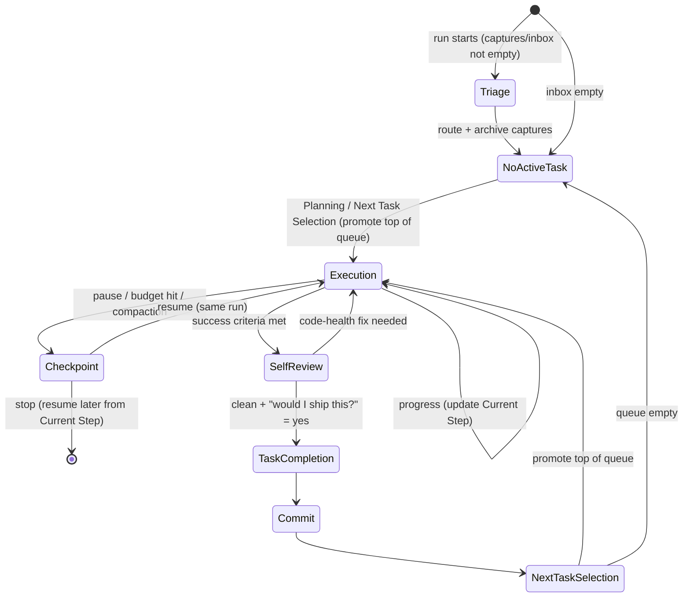

# Development Workflow — Task-Driven Lifecycle

> The repository's development protocol. **Replaces the old session-based model.**
> There is **no "session end."** Work is organized around **tasks** and explicit **events**, never
> around when a conversation or a scheduled process happens to stop. A run/agent that stops simply
> performs a **Checkpoint** first. This file is the source of truth for *when* docs are read/updated.

> **⚠ Migrating to the gated pipeline (DECISIONS D-015 / D-016).** Triage now *routes + enriches into
> `planning/PROPOSALS.md` (pending your approval)* — **never** into a build queue. The Builder builds
> only from `planning/BUILD_QUEUE.md`. Sections below that still describe ROADMAP "Task Queue"
> auto-promotion are **legacy**, pending the Phase 5 rewrite; until then **CLAUDE.md hard rule 0 +
> D-015/D-016 are the source of truth**.

> **⚠ "The Builder" below predates the Claude/Codex split (CLAUDE.md/AGENTS.md v2.0, DECISIONS D-021 /
> D-022).** Building is now Codex's job, triggered manually ("Continue"), never automatic. What this
> file still calls "the Builder builds from `BUILD_QUEUE.md`" is now two separate steps: Claude
> converts an approved `BUILD_QUEUE.md` item into `TASKS.md` entries (`status: codex`) — this can
> happen interactively (the "Plan" command) or unattended, gated behind `$AUTOMATION_ENABLED` in
> `run-claude.ps1` (see `docs/09-automation.md`) — and Codex then implements from `TASKS.md`. A full
> rewrite of this file's "Builder" language to match is a separate follow-up; treat `CLAUDE.md` +
> `AGENTS.md` as authoritative wherever they disagree with the wording below.

## Principles
- One unit of work = one **task**, held in `planning/TASK.md`.
- Docs change at specific **events**, not on a timer or at a vague "end".
- **Code and docs commit together** — the doc update rides in the same commit as the code, so they
  can never drift. This is the enforcement mechanism that replaces "remember at session end".
- The agent **executes** tasks; the human **prioritizes** them. Selection is mechanical FIFO.
- **Capture is dumb; triage is smart.** Mobile captures land in `captures/inbox/` (one immutable file
  each, written by n8n). All judgment happens later, in the Triage event, where the agent has the
  whole repo as context.
- **Goal-driven, not priority-driven.** Every proposal is scored against the single **Current Objective**
  in `ROADMAP.md` (e.g. "alpha stability"), not raw priority — change that one line and the whole
  pipeline re-optimizes the same proposals differently (D-016).
- **Modular stage contracts.** Each stage reads/writes a documented structured shape co-located with its
  artifact (`PROPOSALS.md` = the proposal contract; `BUILD_QUEUE.md` = the sprint/task contract), so any
  one agent can be improved or replaced without redesigning the others (D-016).

## File map
```
root/        CLAUDE.md (router) · STATUS.md (working memory) · WORKFLOW.md · PROMPTS.md
             SELF_REVIEW.md (code-health gate) · QA.md (correctness gate)
planning/    ROADMAP.md (priority) · TASK.md (active task) · DONE.md (completed log)
captures/    inbox/ (new captures) · processed/YYYY/MM/ (triaged archive)
docs/        PROJECT.md · ARCHITECTURE.md · DATA_MODEL.md · FEATURES.md · DECISIONS.md
```

## Lifecycle


---

## The events

### 0. Triage (Intake)  ← runs first, every run
- **Trigger:** start of a run when `captures/inbox/` has any `*.md`. (Captures arrive from the Telegram
  bot via n8n — see `captures/README.md`.)
- **Who:** the agent. This is where a capture becomes an **enriched proposal** — it routes + enriches,
  it does **not** schedule or build (single responsibility, D-015).
- **Reads:** `captures/inbox/*.md`, the **Current Objective** + North-star goals (`ROADMAP.md` /
  `docs/PROJECT.md`), `planning/PROPOSALS.md` + `planning/ROADMAP.md` + `planning/DONE.md` (dedupe), and
  the codebase (file hints).
- **Does**, for each capture with `status: new` (SKIP any already `status: triaged` — idempotency):
  1. **Categorize** — use the `/command`; infer the type if the capture had none.
  2. **Dedupe** — search PROPOSALS + ROADMAP + DONE; if a dup, merge (bump the dup count), don't re-add.
  3. **Enrich into the Proposal contract** (the format in `PROPOSALS.md`), filling every field, **led
     by `▶ Decision`** — the recommended next action (Approve / Park / Reject / Clarify) + a one-line
     why, so the proposal is actionable straight from a phone digest. Then: **goal alignment** (supports
     / conflicts / mixed vs the **Current Objective**, + which North-star goal), **expected user value**,
     **evidence** (recurring friction · dup count · demand signal), **effort / dependencies / confidence
     / ambiguity**, **why now vs later**, and a **goal-adjusted** AI-recommended priority (P0..P3 —
     down-weight work that doesn't serve the Current Objective).
- **Writes:** `planning/PROPOSALS.md` (one `status: pending` proposal per capture); **archives** each
  processed capture to `captures/processed/YYYY/MM/<id>.md` (provenance) and marks the inbox file
  `status: triaged`; a one-line triage summary to `STATUS.md`. **Never** writes `ROADMAP.md` or
  `BUILD_QUEUE.md`, and never builds.
- **Exit:** all captures triaged → stop (proposals await your approval). Build only proceeds if
  `BUILD_QUEUE.md` already holds approved work.

### 1. Planning
- **Trigger:** `TASK.md` is `NO ACTIVE TASK` and a task is needed, or a human has a new idea.
- **Who:** Human (interactive), via `PROMPTS.md` P1. **Autonomous runs never plan** — they don't choose priority or invent work.
- **Reads:** `planning/ROADMAP.md` (queue), `docs/PROJECT.md` (scope), area docs (`docs/FEATURES.md` / `docs/ARCHITECTURE.md` / `docs/DATA_MODEL.md`).
- **Writes:** `planning/TASK.md` (Objective / Current Step / Success Criteria / Definition of Done) and/or the ROADMAP Task Queue.
- **Exit:** `TASK.md` holds exactly one active task whose criteria are verifiable by code inspection.

### 2. Execution
- **Trigger:** `TASK.md` has an active task.
- **Reads:** `TASK.md` + only the docs `CLAUDE.md` routes to for this task type.
- **Does:** Implement. Keep `TASK.md` → **Current Step** updated as a live progress marker — the resume point.
- **Writes (lightweight):** `TASK.md` Current Step only. No reference docs yet.
- **Exit:** criteria pass → **Task Completion**; or work pauses → **Checkpoint**.

### 3. Checkpoint  *(replaces "session end")*
- **Trigger (any):** context about to compact; autonomous run hits token/time budget mid-task; human stops (`/wrap`); a natural break with the task unfinished.
- **Purpose:** Persist enough state to resume with **zero context loss**.
- **Reads:** `TASK.md`, `STATUS.md`.
- **Writes:**
  - `TASK.md` → **Current Step**: what's done, what's left, the precise next action.
  - `STATUS.md` → top entry: task, in-progress state, next concrete step, any blocker.
  - **Optional `wip:` commit** so code-in-progress is saved.
- **Does NOT:** mark Done, advance ROADMAP, or update reference docs.
- **Exit:** resume Execution (same run) **or** stop. A later run resumes from `TASK.md` Current Step.

### 4. Self Review  ← "is this *good code*?" (precedes QA's "does it *work*?")
- **Trigger:** Execution's success criteria are met — but **before** Task Completion / QA / Commit.
- **Who:** the agent reviews **its own diff** as if reviewing a PR. **AI-verifiable** — reads the diff/codebase; no device or human judgment.
- **Does:** run `SELF_REVIEW.md` — the **Code Health** checklist (duplication, magic numbers, complexity, dead code, TODOs, reuse, naming, unnecessary state, unnecessary DOM queries, extract-to-helper) and answer **"Would I ship this?"**.
- **If it finds a problem:** fix it now (simplify, dedupe, delete dead code) and **re-review — before QA**, so QA verifies the clean version.
- **Honesty rule:** if the only hesitation on "Would I ship this?" is a **human-verified** aspect (feel/polish/animation/device), mark it `ship-pending-human-review` and log to `STATUS.md` — never claim it's verified.
- **Exit:** code-health clean **and** "would I ship this?" = yes → **Task Completion**. ("Almost" is a no — fix it.)

### 5. Task Completion
- **Trigger:** **every** Success Criterion in `TASK.md` is verified (by code trace; autonomous also requires any test gate to pass).
- **Conditions for Done:** all criteria ticked **and** the Definition of Done is met. **Partial ≠ Done.**
- **Reads:** `TASK.md` (criteria) + the reference docs for whatever changed.
- **Writes — the doc-sync event:**
  - tick all criteria in `TASK.md`;
  - `docs/FEATURES.md` status (feature changed);
  - `docs/DATA_MODEL.md` (shape/key changed);
  - `docs/ARCHITECTURE.md` (subsystem changed);
  - `docs/DECISIONS.md` — new `D-0NN` if a non-obvious choice was made or reversed;
  - append a completion line to `planning/DONE.md`;
  - `STATUS.md` → "shipped" entry.
- **Exit:** → **Commit**.

### 6. Commit
- **QA gate (mandatory before a production commit):** pass every **AI** check in `QA.md`
  (Functional · Visual · Regression · Data Integrity · Documentation · Git Hygiene). **Any AI check
  fails → Blocked:** record it in `TASK.md` + `STATUS.md` and do NOT commit. Append `QA.md`'s **Human**
  checklist to `STATUS.md` as pending verification (it never blocks the commit).
- **Golden rule:** **code + updated docs go in the same commit.** No deferred doc updates.
- **Trigger:** after Task Completion (a *completion* commit) or after a Checkpoint (a *wip* commit; QA gate may be lighter for `wip:`).
- **Does:** stage code + docs; commit with a message tied to the task; **push** (autonomous) or **propose the message** (interactive — don't push unless asked).
- **Exit:** → **Next Task Selection** (continuing) or stop.

### 7. Next Task Selection
- **Trigger:** a task is Done + committed and work continues.
- **Who:** Mechanical FIFO — **promote the top of the ROADMAP Task Queue into `TASK.md`.** Priority was set by triage score + the human ordering the queue; the agent never re-chooses.
- **Writes:** the finished task is already logged in `planning/DONE.md` (at Task Completion); load the next into `TASK.md`. Queue empty → `TASK.md` = `NO ACTIVE TASK`.
- **Exit:** → Execution (next task) or stop.

---

## When each file changes
| File | Changes at |
|---|---|
| `captures/inbox/*` | created by **n8n** (capture); removed by **Triage** (archived) |
| `captures/processed/**` | **Triage** (archive of processed captures) |
| `planning/TASK.md` | Planning (created) · Execution (Current Step) · Checkpoint (resume point) · Task Completion (ticked) · Next Task Selection (replaced) |
| `STATUS.md` | **Triage** (summary), **Checkpoint**, **Task Completion** |
| `planning/ROADMAP.md` | **Triage** (route captures) · Planning (add tasks) · Next Task Selection (promote) · Blocked parking |
| `planning/DONE.md` | **Task Completion** (append) |
| `docs/DECISIONS.md` | When a non-obvious choice is made/reversed |
| `docs/FEATURES.md` / `DATA_MODEL.md` / `ARCHITECTURE.md` | Task Completion, for the area that changed |
| `docs/PROJECT.md` | Rarely (scope or North-star-goal change) |

**ROADMAP advances only at Next Task Selection. STATUS updates at Triage / Checkpoint / Task Completion. DONE.md appends only at Task Completion. DECISIONS updates only when a real decision is made.**

---

## Autonomous run behavior (scheduled every 5–6 h)
Each run reads `CLAUDE.md` → `STATUS.md` → `planning/TASK.md`, **then runs Triage** (process
`captures/inbox/`), then:

| Situation | Action |
|---|---|
| **Captures in inbox** | **Triage** them first (route + archive) before touching the active task. |
| **Task completed** | Task Completion → Commit → Next Task Selection. Keep going while budget allows; otherwise Checkpoint (clean, between tasks) and stop. |
| **Task partially done** (budget/token limit mid-task) | **Checkpoint**: write Current Step + STATUS in-progress, optional `wip:` commit, **stop**. Don't mark Done or advance ROADMAP. |
| **Task blocked** | Record the blocker in `TASK.md` + `STATUS.md`. Move the task to ROADMAP **Blocked**, promote the next queue item, continue. Queue empty → stop. |
| **No active task** | After triage, if the queue is empty write "No tasks remaining" to `STATUS.md` and stop. Don't plan or invent work. |

Promoting the next FIFO item is **order-following, not prioritizing** — allowed. Choosing *which* task
by judgment is not. (Triage *scores* incoming captures, which sets their queue order — that's intake
ranking against PROJECT.md goals, not the agent overriding the human's queue.)

## Interactive behavior
Identical events. You signal a **Checkpoint** explicitly with `/wrap` whenever you stop — the only
honest "done for now" signal. Nothing tries to detect an implicit end.

## Resuming unfinished work
Any run/session resumes by: read `STATUS.md` top entry → read `planning/TASK.md` **Current Step** →
continue Execution from that exact step. Checkpoint persisted both, so no context is lost between runs.
