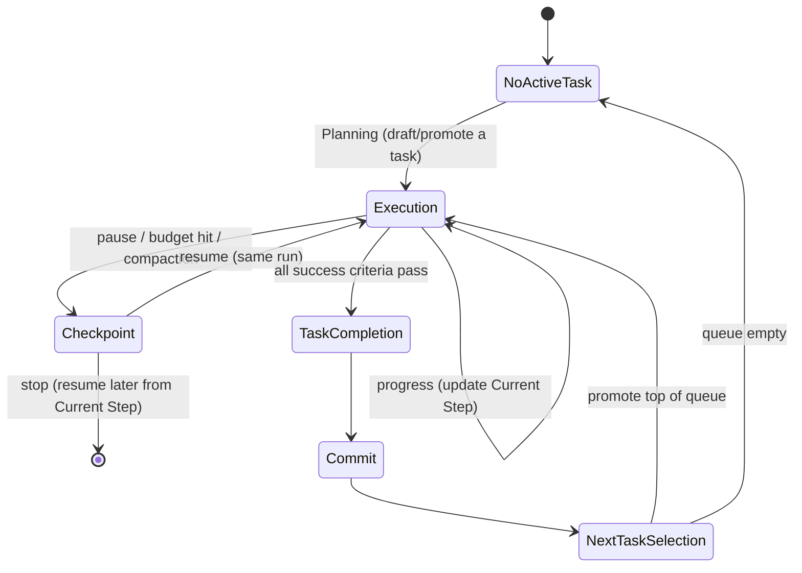

# Development Workflow — Task-Driven Lifecycle

> The repository's development protocol. **Replaces the old session-based model.**
> There is **no "session end."** Work is organized around **tasks** and explicit **events**, never
> around when a conversation or a scheduled process happens to stop. A run/agent that stops simply
> performs a **Checkpoint** first. This file is the source of truth for *when* docs are read/updated.

## Principles
- One unit of work = one **task**, held in `TASK.md`.
- Docs change at specific **events**, not on a timer or at a vague "end".
- **Code and docs commit together** — the doc update rides in the same commit as the code, so they
  can never drift. This is the enforcement mechanism that replaces "remember at session end".
- The agent **executes** tasks; the human **prioritizes** them. Selection is mechanical FIFO.

## Lifecycle

---

## The six events

### 1. Planning
- **Trigger:** `TASK.md` is `NO ACTIVE TASK` and a task is needed, or a human has a new idea.
- **Who:** Human (interactive), via `PROMPTS.md` P1. **Autonomous runs never plan** — they don't choose priority or invent work.
- **Reads:** `ROADMAP.md` (queue), `PROJECT.md` (scope), area docs (`FEATURES.md` / `ARCHITECTURE.md` / `DATA_MODEL.md`).
- **Writes:** `TASK.md` (Objective / Current Step / Success Criteria / Definition of Done) and/or the `ROADMAP.md` Task Queue.
- **Exit:** `TASK.md` holds exactly one active task whose criteria are verifiable by code inspection.

### 2. Execution
- **Trigger:** `TASK.md` has an active task.
- **Reads:** `TASK.md` + only the docs `CLAUDE.md` routes to for this task type.
- **Does:** Implement. Keep `TASK.md` → **Current Step** updated as a live progress marker — this is the resume point.
- **Writes (lightweight):** `TASK.md` Current Step only. No reference docs yet.
- **Exit:** criteria pass → **Task Completion**; or work pauses → **Checkpoint**.

### 3. Checkpoint  *(replaces "session end")*
- **Trigger (any):** context about to compact; autonomous run hits token/time budget mid-task; human stops (`/wrap`); a natural break with the task unfinished.
- **Purpose:** Persist enough state to resume with **zero context loss**.
- **Reads:** `TASK.md`, `STATUS.md`.
- **Writes:**
  - `TASK.md` → **Current Step**: what's done, what's left, the precise next action.
  - `STATUS.md` → top entry: task, in-progress state, next concrete step, any blocker.
  - **Optional `wip:` commit** so code-in-progress is saved.
- **Does NOT:** mark Done, advance `ROADMAP.md`, or update reference docs.
- **Exit:** resume Execution (same run) **or** stop. A later run resumes by reading `TASK.md` Current Step.

### 4. Task Completion
- **Trigger:** **every** Success Criterion in `TASK.md` is verified (by code trace; autonomous also requires any test gate to pass).
- **Conditions for Done:** all criteria ticked **and** the Definition of Done is met. **Partial ≠ Done.**
- **Reads:** `TASK.md` (criteria) + the reference docs for whatever changed.
- **Writes — this is the doc-sync event:**
  - tick all criteria in `TASK.md`;
  - `FEATURES.md` status (feature changed);
  - `DATA_MODEL.md` (shape/key changed);
  - `ARCHITECTURE.md` (subsystem changed);
  - `DECISIONS.md` — new `D-0NN` if a non-obvious choice was made or reversed;
  - `STATUS.md` → "shipped" entry.
- **Exit:** → **Commit**.

### 5. Commit
- **Golden rule:** **code + updated docs go in the same commit.** No deferred doc updates.
- **Trigger:** after Task Completion (a *completion* commit) or after a Checkpoint (a *wip* commit).
- **Does:** stage code + docs; commit with a message tied to the task; **push** (autonomous) or **propose the message** (interactive — don't push unless asked).
- **Exit:** → **Next Task Selection** (continuing) or stop.

### 6. Next Task Selection
- **Trigger:** a task is Done + committed and work continues.
- **Who:** Mechanical FIFO — **promote the top of the `ROADMAP.md` Task Queue into `TASK.md`.** Priority was set by the human ordering the queue; the agent never re-chooses.
- **Writes:** move the finished task to `ROADMAP.md` **Done**; load the next into `TASK.md`. Queue empty → `TASK.md` = `NO ACTIVE TASK`.
- **Exit:** → Execution (next task) or stop.

---

## When each file changes
| File | Changes at |
|---|---|
| `TASK.md` | Planning (created) · Execution (Current Step) · Checkpoint (resume point) · Task Completion (criteria ticked) · Next Task Selection (replaced) |
| `STATUS.md` | **Checkpoint** and **Task Completion** only |
| `ROADMAP.md` | Next Task Selection (done out / next promoted) · Planning (add tasks) · Blocked parking |
| `DECISIONS.md` | When a non-obvious choice is made/reversed (capture at Execution or Task Completion) |
| `FEATURES.md` / `DATA_MODEL.md` / `ARCHITECTURE.md` | Task Completion, for the area that changed |
| `PROJECT.md` | Rarely (scope change) |

**ROADMAP advances only at Next Task Selection.** **STATUS updates only at Checkpoint and Task Completion.** **DECISIONS updates only when a real decision is made.**

---

## Autonomous run behavior (scheduled every 5–6 h)
Each run reads `CLAUDE.md` → `STATUS.md` → `TASK.md`, then:

| Situation | Action |
|---|---|
| **Task completed** | Task Completion → Commit → Next Task Selection. Keep going while budget allows; otherwise Checkpoint (clean, between tasks) and stop. |
| **Task partially done** (budget/token limit mid-task) | **Checkpoint**: write Current Step + STATUS in-progress, optional `wip:` commit, **stop**. Do **not** mark Done or advance ROADMAP. Next run resumes from Current Step. |
| **Task blocked** (ambiguous, missing input, failing gate) | Record the blocker in `TASK.md` (Blocker) + `STATUS.md`. Move the task to `ROADMAP.md` **Blocked**, promote the next queue item, continue. Queue empty → stop. |
| **No active task** | Write "No tasks remaining" to `STATUS.md` and stop. Do **not** plan or invent work. |

Promoting the next FIFO item after a block is **order-following, not prioritizing** — that's allowed.
Choosing *which* task by judgment is not.

## Interactive behavior
Identical events. You signal a **Checkpoint** explicitly with `/wrap` whenever you stop — the only
honest "done for now" signal, and it's human-controlled. Nothing tries to detect an implicit end.

## Resuming unfinished work
Any run/session resumes by: read `STATUS.md` top entry → read `TASK.md` **Current Step** → continue
Execution from that exact step. Because Checkpoint persisted both, no context is lost between runs.
